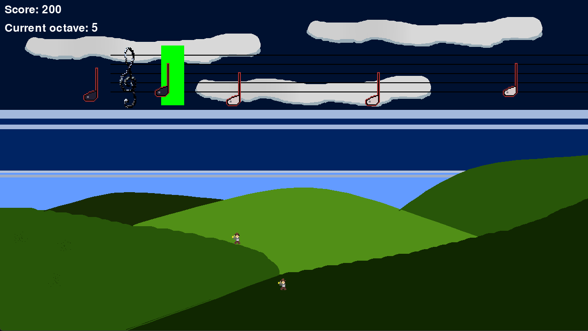

# Piano game



## Installation

   ```bash
   git clone https://github.com/jmikk17/piano-game.git
   cd piano-game
   pip install -r requirements.txt
   python src/main.py
   ```

## Controls
a to j on keyboard used as C5 to C6 on piano, currently no # or b.